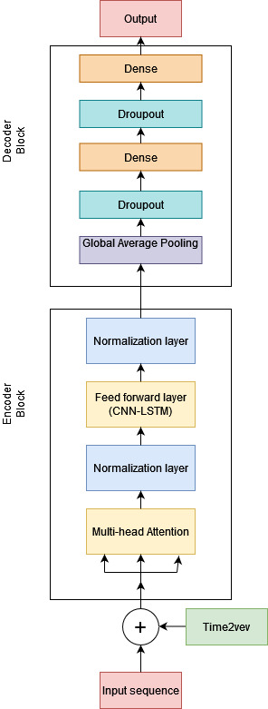
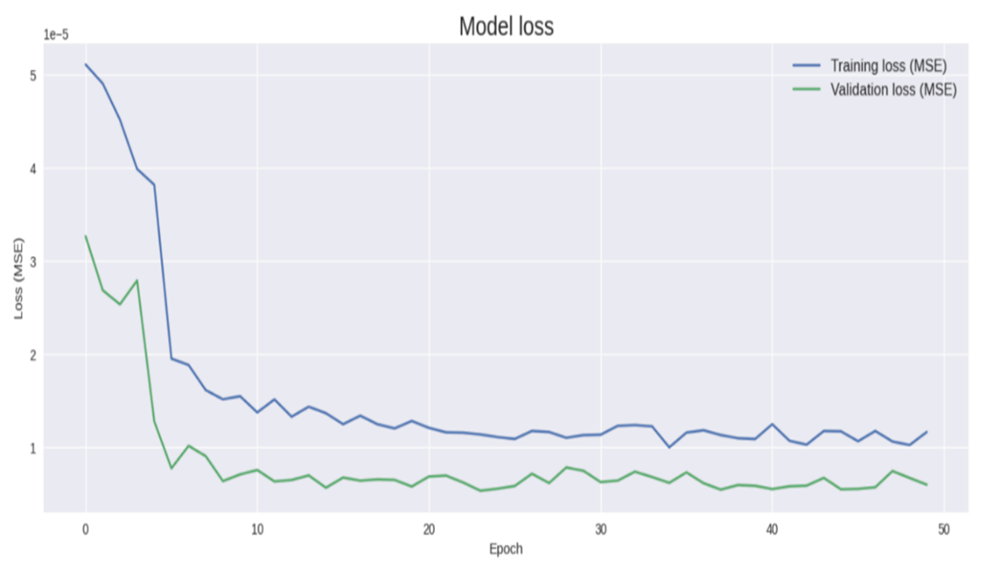

Fig. 1. Implementation of Transformer Network Model by applying CNN-LSTM layer as feed forward layer

# Transformer Network for Time Series Forecasting
This repository contains the implementation of a Transformer Network designed for time series forecasting, with a particular focus on financial market data.

## Article Link
[Link to the Article](https://ieeexplore.ieee.org/abstract/document/10371830)

## Introduction
Our model incorporates innovative techniques Time2Vec for positional encoding and a combination of attention mechanisms, Convolutional Neural Networks (CNNs), and Long Short-Term Memory (LSTM) networks as feed forward layer within the Transformer encoder layers. This approach aims to capture both spatial and temporal dependencies in the data for accurate forecasting.

The preprocessing steps in the provided code can be summarized as follows:
1. **Fetching and Formatting Data:**
   - Historical price data for the S&P 500 index is retrieved using the `YahooFinancials` library.
   - The fetched data is converted into a pandas DataFrame, focusing on the 'prices' key.
2. **Data Cleaning:**
   - The 'date' column is dropped, and 'formatted_date' is set as the new index.
   - Unnecessary columns are removed or rearranged to ensure the data contains only relevant features.
3. **Data Exploration:**
   - Basic descriptive statistics are generated to understand the data better.
   - The DataFrame's shape is checked, and null values are identified and addressed.
4. **Data Transformation:**
   - The 'Volume' column values of 0 are replaced with the forward fill method to handle missing or zero values.
   - The DataFrame is sorted by date.
   - Columns are renamed for clarity and consistency.
5. **Feature Engineering:**
   - Percentage changes (returns) in the 'Adj Close' column are calculated to represent daily returns.
   - A 5-day rolling volatility measure is calculated to understand the price fluctuations over time.
6. **Normalization:**
   - Price and volume columns are normalized to a 0-1 range using the min-max normalization method, based on historical data to avoid lookahead bias.
7. **Data Splitting:**
   - The dataset is split into training, validation, and test sets based on time, ensuring that the model can be evaluated on unseen data.
8. **Handling NaN Values:**
   - Rows containing NaN values are dropped to ensure the model trains on clean data.
9. **Preparing Time Series Data:**
   - The dataset is structured into sequences and targets to fit the model's input requirements. This involves creating subsequences of a specified length (`seq_len`) as input features and the subsequent value as the target.
10. **Visualization:**
    - Various visualizations are created to explore the adjusted close prices, volume over time, and the distribution of daily returns and log returns. Additionally, the volatility trends and the segmentation of the dataset into training, validation, and test sets are visualized to aid in understanding the data's characteristics and the model's performance potential.
These preprocessing steps are crucial for transforming raw financial time series data into a format suitable for time series forecasting or other machine learning tasks, ensuring data quality, and facilitating model development and evaluation.
"""
## Features
- **Time2Vec Positional Encoding:** Enhances the model's ability to capture temporal dynamics by embedding time with periodic and non-periodic patterns.
- **Transformer Encoder Layer:** Utilizes single head and multi-head attention to focus on different segments of input data, improving context understanding.
- **CNN and LSTM Layers:** Integrated within the Transformer encoder to capture a wide range of dependencies in the data.
- **Adaptive Regularization:** Employs dropout techniques to prevent overfitting and improve model generalization.
## Requirements
To run this model, you will need the following:
- Python 3.6 or later
- TensorFlow 2.x
- Keras
- Numpy
## Usage
The main components of the model are defined within `TransformerEncoder` class, which is designed to be integrated into a larger model architecture as shown in the `create_model` function. To use this model for your own time series forecasting tasks, follow these steps:
1. **Prepare your data:** Ensure your time series data is in a suitable format (preferably a NumPy array or a Pandas DataFrame) and properly normalized.
2. **Configure the model parameters:** Adjust the model's parameters such as `d_k`, `d_v`, `n_heads`, `ff_dim`, and `seq_len` according to your dataset's characteristics.
3. **Train the model:** Feed your prepared dataset into the model for training. You may need to tweak the training configuration based on your specific requirements.
4. **Evaluate and forecast:** After training, evaluate the model's performance on a test set and use it for forecasting future values.
## Customization
The model is designed to be flexible and can be adapted for various types of time series data. You can customize the encoder layers, attention mechanisms, and feed-forward network according to your dataset and forecasting goals.
## Contributing
Contributions to improve the model or extend its functionality are welcome. Please feel free to submit pull requests or open issues to discuss potential enhancements.

## Results
The performance of the Transformer Network using Hybrid layer (CNN-LSTM) as feed forward layer is evaluated using Mean Squared Error (MSE), Mean Absolute Error (MAE), and Mean Absolute Percentage Error (MAPE). The results are as follows:
- Transformer Network (applying CNN-LSTM layer as feed forward layer in encoder block):
  - MSE: 1.0801e-05
  - MAE: 0.0021
  - MAPE: 26.9638

Fig 2 illustrates the forecasting result of volatility of S&P 500 using the LSTM approach. The figure presents a visual comparison of the actual volatility value with the corresponding forecasted values. This plot aims to offer a thorough evaluation of the model’s ability to capture the true fluctuations in volatility over time. The blue line represents actual volatility, while the green line represents predicted volatility. This visualization demonstrates the effectiveness of the model in capturing the inherent fluctuations and patterns within the domain of volatility forecasting.

Fig 2. Forecasting result of volatility of S&P 500 

Fig 3 displays a plot depicting MSE loss over 50 epochs. A smooth and steadily declining MSE loss curve serves as an indicator of a training process characterized by effective parameter optimization, resulting in minimized forecasting errors.

Fig 3. Model loss (MSE) by applying TN (LSTM as FFN layer))

